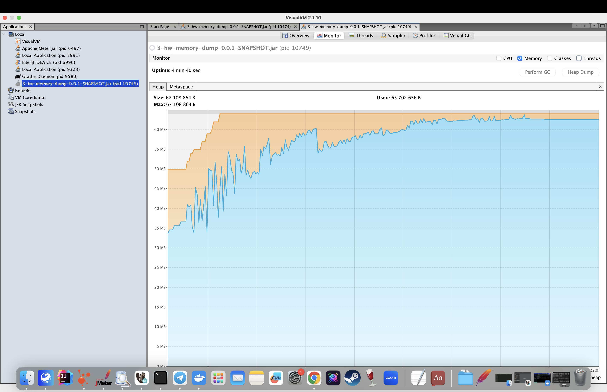
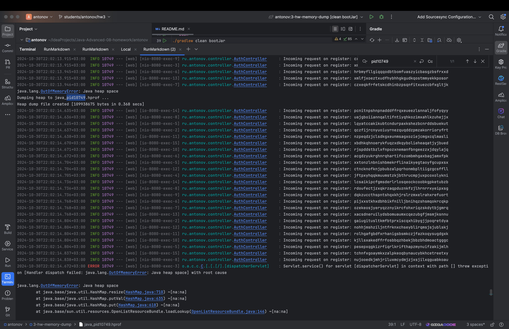
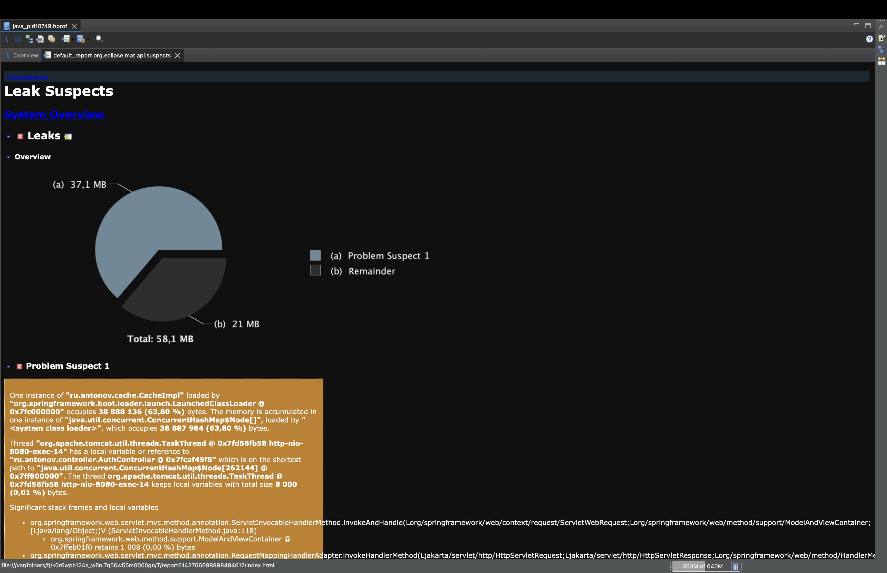
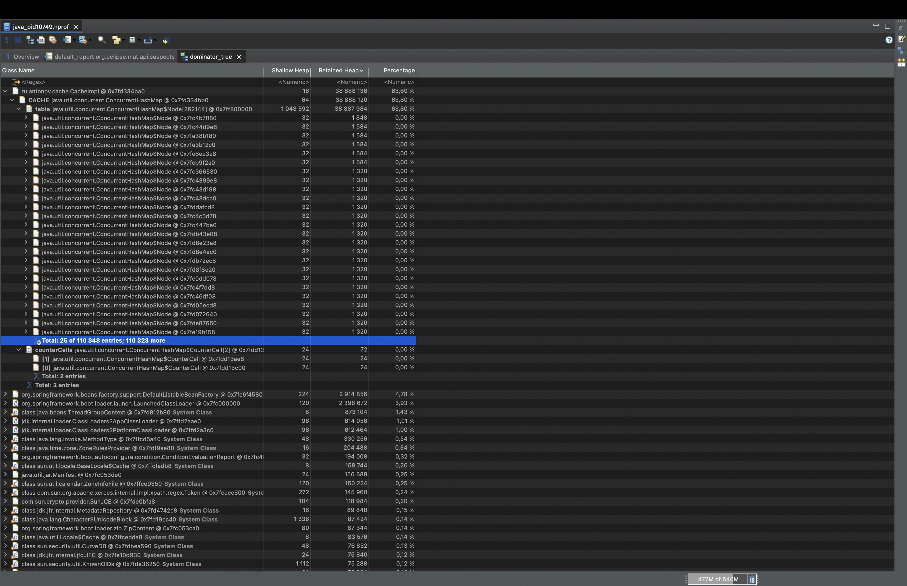
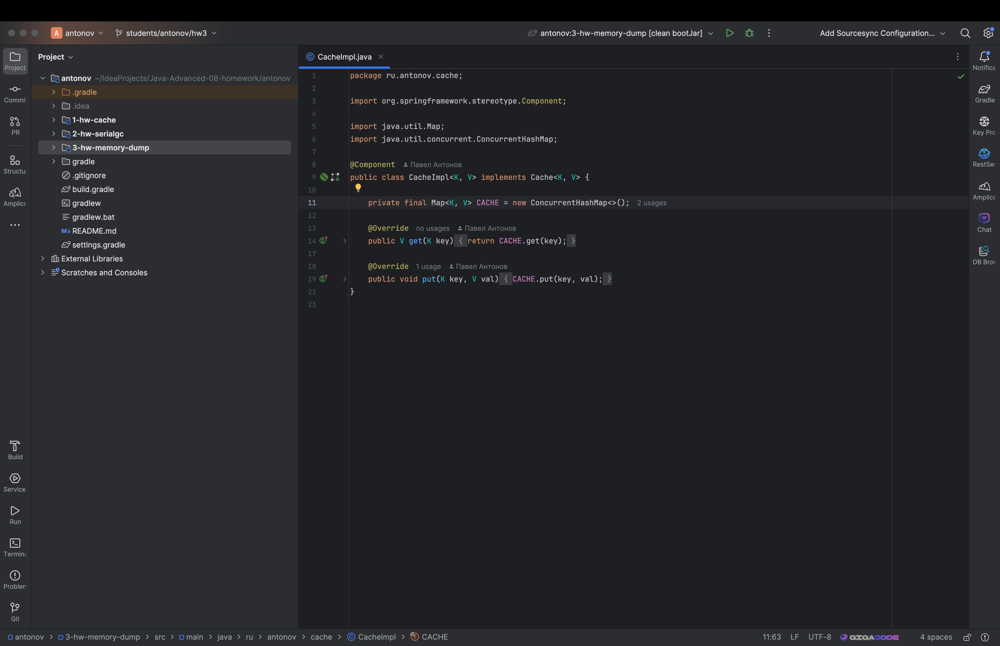
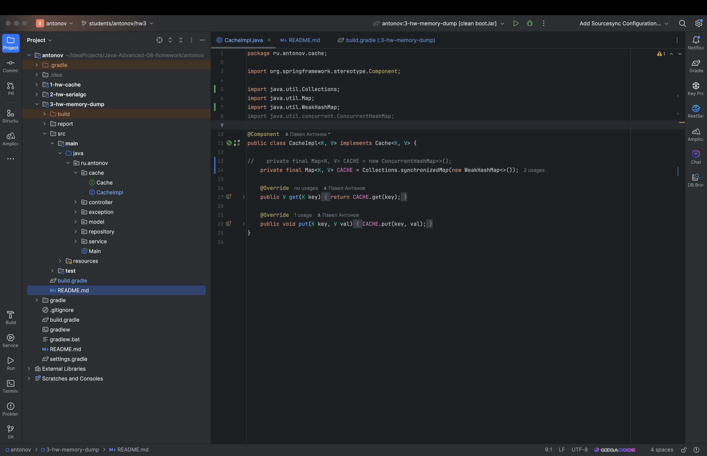
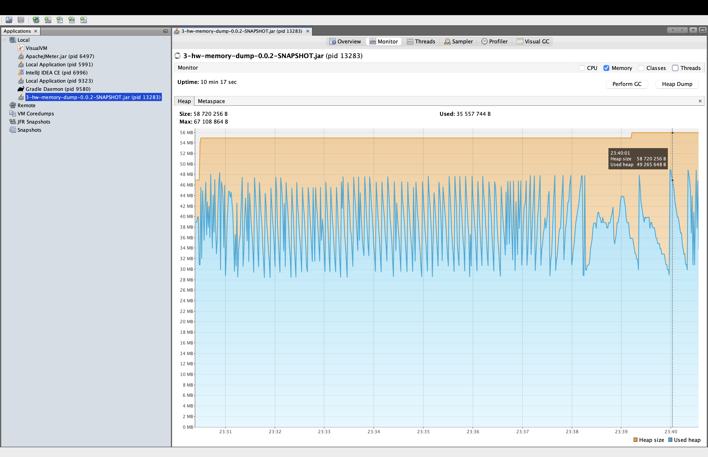
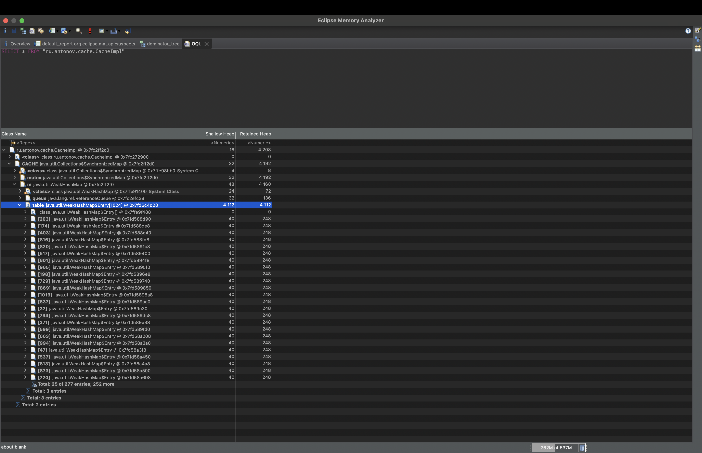

Домашнее задание
Поиск утечки памяти в приложении

Цель:
Создать тестовой приложение с утечкой памяти и найти её с помощью специальных инструментов

Описание/Пошаговая инструкция выполнения домашнего задания:

1. Реализоавть простое приложение на spring boot:

1.1 Сервис регистрации пользователя в системе: rest service принимающий login и password от пользователя

1.2 Для хранение данных использовать БД H2

1.3 Для доступа к данным использовать Spring JPA

2. Заложить проблему, вызывающую OutOfMemoryError. Примечание: приложение должно постепенно копить мусор в течение
   нескольких минут

3. Запускать приложение с инструкцией, позволяющей собирать дамп хипа перед падением

4. Провести анализ дампа инструментам Eclipse Memory Analyzer Tool, найти утечку, и предоставить скиншот того места, где
   можно сделать вывод об утечку (с комментариями, поясняющими почему вы считаете это место утечкой)

5. Поправить утечку памяти (отдельным коммитом в пулл реквесте).

---
**Анализ проблемы**

Для запуска проекта требуется бд postrges

```bash
docker stop pg-docker
docker rm pg-docker
docker run --rm --name pg-docker \
-e POSTGRES_PASSWORD=pwd \
-e POSTGRES_USER=usr \
-e POSTGRES_DB=testdb \
-p 5430:5432 \
postgres:12
```

Сборка приложения:
```bash
./gradlew clean bootJar
```
Запуск:
```bash
java -Xmx64m -XX:+HeapDumpOnOutOfMemoryError -jar build/libs/3-hw-memory-dump-0.0.1-SNAPSHOT.jar
```
Запускаем JMeter с подготовленным нагрузочным тест планом [TestPlan.jmx](src/test/resources/TestPlan.jmx)

Наблюдаем за утилизацией памяти в приложении


Наблюдаем, что через 4 минуты работы, приложение использовало всю доступную память, в следствии чего возникла ошибка java.lang.OutOfMemoryError
```log
java.lang.OutOfMemoryError: Java heap space
Dumping heap to java_pid10749.hprof ...
Heap dump file created [109938675 bytes in 0.368 secs]
```



В корне директории jvm собрала heap dump в файл с именем java_pid10749.hprof

открываем java_pid10749.hprof с помощью утилиты Eclipse Memory Analyzer


Eclipse Memory Analyzer показывает нам, подозрение на утчеку памяти
в инстансе класса [[CacheImpl.java](src/main/java/ru/antonov/cache/CacheImpl.java)]

Посмотрим более детально, на анализ хипа, построим dominator tree


Видим, что инстанс класса ru.antonov.cache.CacheImpl содержит в себе переменную **CACHE** типа java.util.concurrent.ConcurrentHashMap
которая занимает 63.8% памяти от хипа(38887984 байт) этот класс и есть причина утечки памяти в приложении.
Проблемма в 11 строчке кода


---
**Решение проблеммы**

Заменим ConcurrentHashMap на WeakHashMap, что бы данные в кеше удалялись, 
если памяти будет не достаточно, для нормальной работы приложения



Снова запустим приложение и подадим нагрузку

```bash
docker stop pg-docker
docker rm pg-docker
docker run --rm --name pg-docker \
-e POSTGRES_PASSWORD=pwd \
-e POSTGRES_USER=usr \
-e POSTGRES_DB=testdb \
-p 5430:5432 \
postgres:12 
```

Собираем и запускаем приложение
```bash
./gradlew clean bootJar
```
```bash
java -Xmx64m -XX:+HeapDumpOnOutOfMemoryError -jar build/libs/3-hw-memory-dump-0.0.2-SNAPSHOT.jar
```

Посмотрим, на утилизацию памяти



Наблюдаем, что на протяжении 10 минут утечки памяти не происходит

Снимем дамп и посмотрим на класс, в котором раньше была утечка


Проблема устранена

