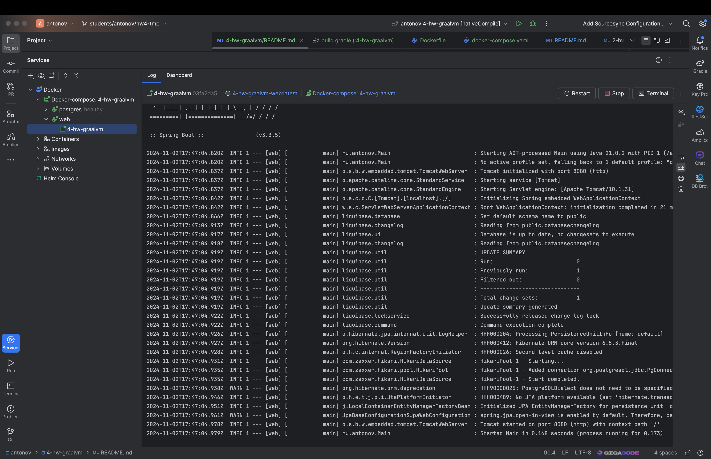

Домашнее задание
Анализ ускорения работы приложения при работе на GraalVM

Цель:
Запустить ранее написанное приложение на GraalVM и оценить время старта и работы приложения (ускорение по отношению к обычной имплементации java)


Описание/Пошаговая инструкция выполнения домашнего задания:

1. Реализовать простое приложение на Spring Boot 3 (из занятия Memory management. JVM memory structure)

2. Добавить плагин для сборки Native Image файлов

3. Выполнить сборку в Native Image

4. Запустить полученный файл и сравнить время запуска с запуском на JVM

5. Зафиксировать результаты (можно указать железо на котором выполнялся запуск)

6. Добавить простой unit тест и запустить nativeTestCompiler (Gradle)

7. *запустить файл в Docker

---
Для запуска проекта требуется бд postrges

```bash
docker stop pg-docker
docker rm pg-docker
docker run --rm --name pg-docker \
-e POSTGRES_PASSWORD=pwd \
-e POSTGRES_USER=usr \
-e POSTGRES_DB=testdb \
-p 5430:5432 \
postgres:12
```

Сборка и запуск приложения на OpenJDK 21
```bash
java --version
```
```log
pavel@mac 4-hw-graalvm % java --version
openjdk 21.0.5 2024-10-15
OpenJDK Runtime Environment Homebrew (build 21.0.5)
OpenJDK 64-Bit Server VM Homebrew (build 21.0.5, mixed mode, sharing)
```
```bash
cd ..
./gradlew :4-hw-graalvm:clean
```
```bash
cd ..
./gradlew clean booJar
```
Сборка проекта заняла 4 секунды
```log
BUILD SUCCESSFUL in 4s
```
Запустим проект на OpenJDK
```bash
java -jar build/libs/4-hw-graalvm-0.0.1-SNAPSHOT.jar
```
Время старта приложени:  2.629
```log
2024-11-02T19:18:03.187+03:00  INFO 12854 --- [web] [           main] ru.antonov.Main                          : Starting Main v0.0.1-SNAPSHOT using Java 21.0.5 with PID 12854 (/Users/pavel/IdeaProjects/Java-Advanced-08-homework/antonov/4-hw-graalvm/build/libs/4-hw-graalvm-0.0.1-SNAPSHOT.jar started by pavel in /Users/pavel/IdeaProjects/Java-Advanced-08-homework/antonov/4-hw-graalvm)
2024-11-02T19:18:03.188+03:00  INFO 12854 --- [web] [           main] ru.antonov.Main                          : No active profile set, falling back to 1 default profile: "default"
2024-11-02T19:18:03.547+03:00  INFO 12854 --- [web] [           main] .s.d.r.c.RepositoryConfigurationDelegate : Bootstrapping Spring Data JPA repositories in DEFAULT mode.
2024-11-02T19:18:03.577+03:00  INFO 12854 --- [web] [           main] .s.d.r.c.RepositoryConfigurationDelegate : Finished Spring Data repository scanning in 25 ms. Found 1 JPA repository interface.
2024-11-02T19:18:03.868+03:00  INFO 12854 --- [web] [           main] o.s.b.w.embedded.tomcat.TomcatWebServer  : Tomcat initialized with port 8080 (http)
2024-11-02T19:18:03.878+03:00  INFO 12854 --- [web] [           main] o.apache.catalina.core.StandardService   : Starting service [Tomcat]
2024-11-02T19:18:03.878+03:00  INFO 12854 --- [web] [           main] o.apache.catalina.core.StandardEngine    : Starting Servlet engine: [Apache Tomcat/10.1.31]
2024-11-02T19:18:03.901+03:00  INFO 12854 --- [web] [           main] o.a.c.c.C.[Tomcat].[localhost].[/]       : Initializing Spring embedded WebApplicationContext
2024-11-02T19:18:03.902+03:00  INFO 12854 --- [web] [           main] w.s.c.ServletWebServerApplicationContext : Root WebApplicationContext: initialization completed in 687 ms
2024-11-02T19:18:04.127+03:00  INFO 12854 --- [web] [           main] liquibase.database                       : Set default schema name to public
2024-11-02T19:18:04.379+03:00  INFO 12854 --- [web] [           main] liquibase.changelog                      : Reading from public.databasechangelog
2024-11-02T19:18:04.404+03:00  INFO 12854 --- [web] [           main] liquibase.ui                             : Database is up to date, no changesets to execute
2024-11-02T19:18:04.407+03:00  INFO 12854 --- [web] [           main] liquibase.changelog                      : Reading from public.databasechangelog
2024-11-02T19:18:04.411+03:00  INFO 12854 --- [web] [           main] liquibase.util                           : UPDATE SUMMARY
2024-11-02T19:18:04.411+03:00  INFO 12854 --- [web] [           main] liquibase.util                           : Run:                          0
2024-11-02T19:18:04.411+03:00  INFO 12854 --- [web] [           main] liquibase.util                           : Previously run:               1
2024-11-02T19:18:04.411+03:00  INFO 12854 --- [web] [           main] liquibase.util                           : Filtered out:                 0
2024-11-02T19:18:04.411+03:00  INFO 12854 --- [web] [           main] liquibase.util                           : -------------------------------
2024-11-02T19:18:04.411+03:00  INFO 12854 --- [web] [           main] liquibase.util                           : Total change sets:            1
2024-11-02T19:18:04.411+03:00  INFO 12854 --- [web] [           main] liquibase.util                           : Update summary generated
2024-11-02T19:18:04.432+03:00  INFO 12854 --- [web] [           main] liquibase.lockservice                    : Successfully released change log lock
2024-11-02T19:18:04.434+03:00  INFO 12854 --- [web] [           main] liquibase.command                        : Command execution complete
2024-11-02T19:18:04.479+03:00  INFO 12854 --- [web] [           main] o.hibernate.jpa.internal.util.LogHelper  : HHH000204: Processing PersistenceUnitInfo [name: default]
2024-11-02T19:18:04.508+03:00  INFO 12854 --- [web] [           main] org.hibernate.Version                    : HHH000412: Hibernate ORM core version 6.5.3.Final
2024-11-02T19:18:04.524+03:00  INFO 12854 --- [web] [           main] o.h.c.internal.RegionFactoryInitiator    : HHH000026: Second-level cache disabled
2024-11-02T19:18:04.683+03:00  INFO 12854 --- [web] [           main] o.s.o.j.p.SpringPersistenceUnitInfo      : No LoadTimeWeaver setup: ignoring JPA class transformer
2024-11-02T19:18:04.705+03:00  INFO 12854 --- [web] [           main] com.zaxxer.hikari.HikariDataSource       : HikariPool-1 - Starting...
2024-11-02T19:18:04.724+03:00  INFO 12854 --- [web] [           main] com.zaxxer.hikari.pool.HikariPool        : HikariPool-1 - Added connection org.postgresql.jdbc.PgConnection@799fb45e
2024-11-02T19:18:04.725+03:00  INFO 12854 --- [web] [           main] com.zaxxer.hikari.HikariDataSource       : HikariPool-1 - Start completed.
2024-11-02T19:18:04.744+03:00  WARN 12854 --- [web] [           main] org.hibernate.orm.deprecation            : HHH90000025: PostgreSQLDialect does not need to be specified explicitly using 'hibernate.dialect' (remove the property setting and it will be selected by default)
2024-11-02T19:18:05.149+03:00  INFO 12854 --- [web] [           main] o.h.e.t.j.p.i.JtaPlatformInitiator       : HHH000489: No JTA platform available (set 'hibernate.transaction.jta.platform' to enable JTA platform integration)
2024-11-02T19:18:05.181+03:00  INFO 12854 --- [web] [           main] j.LocalContainerEntityManagerFactoryBean : Initialized JPA EntityManagerFactory for persistence unit 'default'
2024-11-02T19:18:05.383+03:00  WARN 12854 --- [web] [           main] JpaBaseConfiguration$JpaWebConfiguration : spring.jpa.open-in-view is enabled by default. Therefore, database queries may be performed during view rendering. Explicitly configure spring.jpa.open-in-view to disable this warning
2024-11-02T19:18:05.576+03:00  INFO 12854 --- [web] [           main] o.s.b.w.embedded.tomcat.TomcatWebServer  : Tomcat started on port 8080 (http) with context path '/'
2024-11-02T19:18:05.582+03:00  INFO 12854 --- [web] [           main] ru.antonov.Main                          : Started Main in 2.629 seconds (process running for 2.904)
```

Теперь скомпилируем и запустим приложение с помощью graalvm 21

```bash
export JAVA_HOME=/Library/Java/JavaVirtualMachines/graalvm-jdk-21/Contents/Home
export PATH=/Library/Java/JavaVirtualMachines/graalvm-jdk-21/Contents/Home/bin:"$PATH"
java --version
```

```log
java 21.0.5 2024-10-15 LTS
Java(TM) SE Runtime Environment Oracle GraalVM 21.0.5+9.1 (build 21.0.5+9-LTS-jvmci-23.1-b48)
Java HotSpot(TM) 64-Bit Server VM Oracle GraalVM 21.0.5+9.1 (build 21.0.5+9-LTS-jvmci-23.1-b48, mixed mode, sharing)
```

```bash
cd ..
./gradlew :4-hw-graalvm:nativeCompile
```
Компиляция проекта заняла более 4 минут
```log
Finished generating '4-hw-graalvm' in 4m 39s.
```
Запускаем
```bash
./build/native/nativeCompile/4-hw-graalvm
```
Видим, что время запуска составляет 0.172 секунды
```log
2024-11-02T19:54:03.462+03:00  INFO 941 --- [web] [           main] ru.antonov.Main                          : Starting AOT-processed Main using Java 21.0.5 with PID 941 (/Users/pavel/IdeaProjects/Java-Advanced-08-homework/antonov/4-hw-graalvm/build/native/nativeCompile/4-hw-graalvm started by pavel in /Users/pavel/IdeaProjects/Java-Advanced-08-homework/antonov/4-hw-graalvm)
2024-11-02T19:54:03.462+03:00  INFO 941 --- [web] [           main] ru.antonov.Main                          : No active profile set, falling back to 1 default profile: "default"
2024-11-02T19:54:03.474+03:00  INFO 941 --- [web] [           main] o.s.b.w.embedded.tomcat.TomcatWebServer  : Tomcat initialized with port 8080 (http)
2024-11-02T19:54:03.475+03:00  INFO 941 --- [web] [           main] o.apache.catalina.core.StandardService   : Starting service [Tomcat]
2024-11-02T19:54:03.475+03:00  INFO 941 --- [web] [           main] o.apache.catalina.core.StandardEngine    : Starting Servlet engine: [Apache Tomcat/10.1.31]
2024-11-02T19:54:03.479+03:00  INFO 941 --- [web] [           main] o.a.c.c.C.[Tomcat].[localhost].[/]       : Initializing Spring embedded WebApplicationContext
2024-11-02T19:54:03.479+03:00  INFO 941 --- [web] [           main] w.s.c.ServletWebServerApplicationContext : Root WebApplicationContext: initialization completed in 17 ms
2024-11-02T19:54:03.515+03:00  INFO 941 --- [web] [           main] liquibase.database                       : Set default schema name to public
2024-11-02T19:54:03.545+03:00  INFO 941 --- [web] [           main] liquibase.changelog                      : Reading from public.databasechangelog
2024-11-02T19:54:03.551+03:00  INFO 941 --- [web] [           main] liquibase.ui                             : Database is up to date, no changesets to execute
2024-11-02T19:54:03.552+03:00  INFO 941 --- [web] [           main] liquibase.changelog                      : Reading from public.databasechangelog
2024-11-02T19:54:03.553+03:00  INFO 941 --- [web] [           main] liquibase.util                           : UPDATE SUMMARY
2024-11-02T19:54:03.553+03:00  INFO 941 --- [web] [           main] liquibase.util                           : Run:                          0
2024-11-02T19:54:03.553+03:00  INFO 941 --- [web] [           main] liquibase.util                           : Previously run:               1
2024-11-02T19:54:03.553+03:00  INFO 941 --- [web] [           main] liquibase.util                           : Filtered out:                 0
2024-11-02T19:54:03.553+03:00  INFO 941 --- [web] [           main] liquibase.util                           : -------------------------------
2024-11-02T19:54:03.553+03:00  INFO 941 --- [web] [           main] liquibase.util                           : Total change sets:            1
2024-11-02T19:54:03.553+03:00  INFO 941 --- [web] [           main] liquibase.util                           : Update summary generated
2024-11-02T19:54:03.557+03:00  INFO 941 --- [web] [           main] liquibase.lockservice                    : Successfully released change log lock
2024-11-02T19:54:03.557+03:00  INFO 941 --- [web] [           main] liquibase.command                        : Command execution complete
2024-11-02T19:54:03.560+03:00  INFO 941 --- [web] [           main] o.hibernate.jpa.internal.util.LogHelper  : HHH000204: Processing PersistenceUnitInfo [name: default]
2024-11-02T19:54:03.562+03:00  INFO 941 --- [web] [           main] org.hibernate.Version                    : HHH000412: Hibernate ORM core version 6.5.3.Final
2024-11-02T19:54:03.563+03:00  INFO 941 --- [web] [           main] o.h.c.internal.RegionFactoryInitiator    : HHH000026: Second-level cache disabled
2024-11-02T19:54:03.580+03:00  INFO 941 --- [web] [           main] com.zaxxer.hikari.HikariDataSource       : HikariPool-1 - Starting...
2024-11-02T19:54:03.589+03:00  INFO 941 --- [web] [           main] com.zaxxer.hikari.pool.HikariPool        : HikariPool-1 - Added connection org.postgresql.jdbc.PgConnection@6dd218f1
2024-11-02T19:54:03.589+03:00  INFO 941 --- [web] [           main] com.zaxxer.hikari.HikariDataSource       : HikariPool-1 - Start completed.
2024-11-02T19:54:03.594+03:00  WARN 941 --- [web] [           main] org.hibernate.orm.deprecation            : HHH90000025: PostgreSQLDialect does not need to be specified explicitly using 'hibernate.dialect' (remove the property setting and it will be selected by default)
2024-11-02T19:54:03.601+03:00  INFO 941 --- [web] [           main] o.h.e.t.j.p.i.JtaPlatformInitiator       : HHH000489: No JTA platform available (set 'hibernate.transaction.jta.platform' to enable JTA platform integration)
2024-11-02T19:54:03.606+03:00  INFO 941 --- [web] [           main] j.LocalContainerEntityManagerFactoryBean : Initialized JPA EntityManagerFactory for persistence unit 'default'
2024-11-02T19:54:03.612+03:00  WARN 941 --- [web] [           main] JpaBaseConfiguration$JpaWebConfiguration : spring.jpa.open-in-view is enabled by default. Therefore, database queries may be performed during view rendering. Explicitly configure spring.jpa.open-in-view to disable this warning
2024-11-02T19:54:03.626+03:00  INFO 941 --- [web] [           main] o.s.b.w.embedded.tomcat.TomcatWebServer  : Tomcat started on port 8080 (http) with context path '/'
2024-11-02T19:54:03.627+03:00  INFO 941 --- [web] [           main] ru.antonov.Main                          : Started Main in 0.172 seconds (process running for 0.179)
```

---
сборка и запуск выполняются на MacBook Pro 16
процессор: 10-ядерный Apple M1 Pro
память: 32Gb
операционная система: macOS Sonoma 14.5

Итог:
1. Компиляция проекта 
* OpenJDK - 4s
* GraalVM - 4m 39s
2. Старт приложения
* OpenJDK - 2.629 seconds
* GraalVM - 0.172 seconds

Мы можем наблюдать, что за очень быстрый старт , приходится платить очень долгим временем компиляции приложения

---
Скомпилируем и запустим тесты
```bash
cd ..
export JAVA_HOME=/Library/Java/JavaVirtualMachines/graalvm-jdk-21/Contents/Home
export PATH=/Library/Java/JavaVirtualMachines/graalvm-jdk-21/Contents/Home/bin:"$PATH"
./gradlew :4-hw-graalvm:nativeTestCompile
```
Время компиляции тестов:
```log 
Finished generating '4-hw-graalvm-tests' in 1m 18s.
```
Запустим тесты
```bash
./build/native/nativeTestCompile/4-hw-graalvm-tests
```
Результат
```log
pavel@mac 4-hw-graalvm % ./build/native/nativeTestCompile/4-hw-graalvm-tests
JUnit Platform on Native Image - report
----------------------------------------

ru.antonov.model.converter.UserConverterImplTest > toDto() SUCCESSFUL

ru.antonov.model.converter.UserConverterImplTest > toEntity() SUCCESSFUL


Test run finished after 7 ms
[         2 containers found      ]
[         0 containers skipped    ]
[         2 containers started    ]
[         0 containers aborted    ]
[         2 containers successful ]
[         0 containers failed     ]
[         2 tests found           ]
[         0 tests skipped         ]
[         2 tests started         ]
[         0 tests aborted         ]
[         2 tests successful      ]
[         0 tests failed          ]

pavel@mac 4-hw-graalvm % 
```
удалим контейнер с постгресом, который создали ранее
тк в [docker-compose.yaml](docker-compose.yaml) есть контейнер с бд
```bash
docker stop pg-docker
````
Соберем и запустим приложение в контейнере докера

```bash
docker compose up
```
Приложение запущено в докере
```log
4-hw-graalvm  | 
4-hw-graalvm  |   .   ____          _            __ _ _
4-hw-graalvm  |  /\\ / ___'_ __ _ _(_)_ __  __ _ \ \ \ \
4-hw-graalvm  | ( ( )\___ | '_ | '_| | '_ \/ _` | \ \ \ \
4-hw-graalvm  |  \\/  ___)| |_)| | | | | || (_| |  ) ) ) )
4-hw-graalvm  |   '  |____| .__|_| |_|_| |_\__, | / / / /
4-hw-graalvm  |  =========|_|==============|___/=/_/_/_/
4-hw-graalvm  | 
4-hw-graalvm  |  :: Spring Boot ::                (v3.3.5)
4-hw-graalvm  | 
4-hw-graalvm  | 2024-11-02T17:47:04.820Z  INFO 1 --- [web] [           main] ru.antonov.Main                          : Starting AOT-processed Main using Java 21.0.2 with PID 1 (/app/4-hw-graalvm started by root in /)
4-hw-graalvm  | 2024-11-02T17:47:04.820Z  INFO 1 --- [web] [           main] ru.antonov.Main                          : No active profile set, falling back to 1 default profile: "default"
4-hw-graalvm  | 2024-11-02T17:47:04.837Z  INFO 1 --- [web] [           main] o.s.b.w.embedded.tomcat.TomcatWebServer  : Tomcat initialized with port 8080 (http)
4-hw-graalvm  | 2024-11-02T17:47:04.837Z  INFO 1 --- [web] [           main] o.apache.catalina.core.StandardService   : Starting service [Tomcat]
4-hw-graalvm  | 2024-11-02T17:47:04.837Z  INFO 1 --- [web] [           main] o.apache.catalina.core.StandardEngine    : Starting Servlet engine: [Apache Tomcat/10.1.31]
4-hw-graalvm  | 2024-11-02T17:47:04.842Z  INFO 1 --- [web] [           main] o.a.c.c.C.[Tomcat].[localhost].[/]       : Initializing Spring embedded WebApplicationContext
4-hw-graalvm  | 2024-11-02T17:47:04.842Z  INFO 1 --- [web] [           main] w.s.c.ServletWebServerApplicationContext : Root WebApplicationContext: initialization completed in 21 ms
4-hw-graalvm  | 2024-11-02T17:47:04.866Z  INFO 1 --- [web] [           main] liquibase.database                       : Set default schema name to public
4-hw-graalvm  | 2024-11-02T17:47:04.913Z  INFO 1 --- [web] [           main] liquibase.changelog                      : Reading from public.databasechangelog
4-hw-graalvm  | 2024-11-02T17:47:04.917Z  INFO 1 --- [web] [           main] liquibase.ui                             : Database is up to date, no changesets to execute
4-hw-graalvm  | 2024-11-02T17:47:04.918Z  INFO 1 --- [web] [           main] liquibase.changelog                      : Reading from public.databasechangelog
4-hw-graalvm  | 2024-11-02T17:47:04.919Z  INFO 1 --- [web] [           main] liquibase.util                           : UPDATE SUMMARY
4-hw-graalvm  | 2024-11-02T17:47:04.919Z  INFO 1 --- [web] [           main] liquibase.util                           : Run:                          0
4-hw-graalvm  | 2024-11-02T17:47:04.919Z  INFO 1 --- [web] [           main] liquibase.util                           : Previously run:               1
4-hw-graalvm  | 2024-11-02T17:47:04.919Z  INFO 1 --- [web] [           main] liquibase.util                           : Filtered out:                 0
4-hw-graalvm  | 2024-11-02T17:47:04.919Z  INFO 1 --- [web] [           main] liquibase.util                           : -------------------------------
4-hw-graalvm  | 2024-11-02T17:47:04.919Z  INFO 1 --- [web] [           main] liquibase.util                           : Total change sets:            1
4-hw-graalvm  | 2024-11-02T17:47:04.919Z  INFO 1 --- [web] [           main] liquibase.util                           : Update summary generated
4-hw-graalvm  | 2024-11-02T17:47:04.922Z  INFO 1 --- [web] [           main] liquibase.lockservice                    : Successfully released change log lock
4-hw-graalvm  | 2024-11-02T17:47:04.922Z  INFO 1 --- [web] [           main] liquibase.command                        : Command execution complete
4-hw-graalvm  | 2024-11-02T17:47:04.926Z  INFO 1 --- [web] [           main] o.hibernate.jpa.internal.util.LogHelper  : HHH000204: Processing PersistenceUnitInfo [name: default]
4-hw-graalvm  | 2024-11-02T17:47:04.927Z  INFO 1 --- [web] [           main] org.hibernate.Version                    : HHH000412: Hibernate ORM core version 6.5.3.Final
4-hw-graalvm  | 2024-11-02T17:47:04.928Z  INFO 1 --- [web] [           main] o.h.c.internal.RegionFactoryInitiator    : HHH000026: Second-level cache disabled
4-hw-graalvm  | 2024-11-02T17:47:04.931Z  INFO 1 --- [web] [           main] com.zaxxer.hikari.HikariDataSource       : HikariPool-1 - Starting...
4-hw-graalvm  | 2024-11-02T17:47:04.935Z  INFO 1 --- [web] [           main] com.zaxxer.hikari.pool.HikariPool        : HikariPool-1 - Added connection org.postgresql.jdbc.PgConnection@34b98b4f
4-hw-graalvm  | 2024-11-02T17:47:04.935Z  INFO 1 --- [web] [           main] com.zaxxer.hikari.HikariDataSource       : HikariPool-1 - Start completed.
4-hw-graalvm  | 2024-11-02T17:47:04.938Z  WARN 1 --- [web] [           main] org.hibernate.orm.deprecation            : HHH90000025: PostgreSQLDialect does not need to be specified explicitly using 'hibernate.dialect' (remove the property setting and it will be selected by default)
4-hw-graalvm  | 2024-11-02T17:47:04.946Z  INFO 1 --- [web] [           main] o.h.e.t.j.p.i.JtaPlatformInitiator       : HHH000489: No JTA platform available (set 'hibernate.transaction.jta.platform' to enable JTA platform integration)
4-hw-graalvm  | 2024-11-02T17:47:04.951Z  INFO 1 --- [web] [           main] j.LocalContainerEntityManagerFactoryBean : Initialized JPA EntityManagerFactory for persistence unit 'default'
4-hw-graalvm  | 2024-11-02T17:47:04.961Z  WARN 1 --- [web] [           main] JpaBaseConfiguration$JpaWebConfiguration : spring.jpa.open-in-view is enabled by default. Therefore, database queries may be performed during view rendering. Explicitly configure spring.jpa.open-in-view to disable this warning
4-hw-graalvm  | 2024-11-02T17:47:04.978Z  INFO 1 --- [web] [           main] o.s.b.w.embedded.tomcat.TomcatWebServer  : Tomcat started on port 8080 (http) with context path '/'
4-hw-graalvm  | 2024-11-02T17:47:04.979Z  INFO 1 --- [web] [           main] ru.antonov.Main                          : Started Main in 0.168 seconds (process running for 0.173)
```

