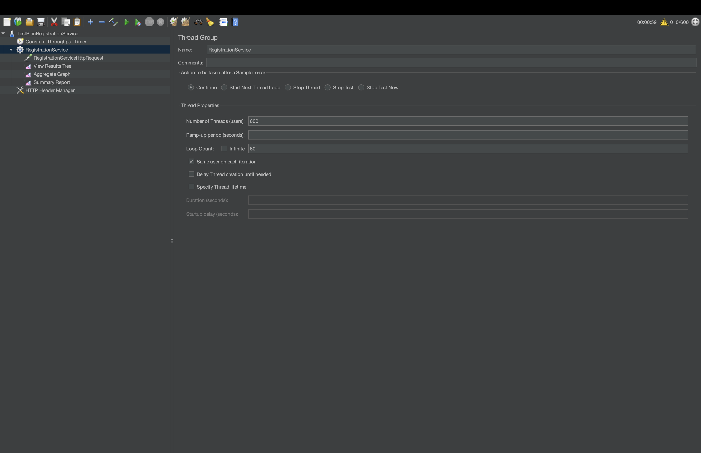

Домашнее задание
Реализовать генератор нагрузки

Цель:
Сделать генератор нагрузки для выбранного протокола

Описание/Пошаговая инструкция выполнения домашнего задания:
Для выполнения задания потребуется сервис регистрации пользователя, реализованный ранее.

Создать тестовый план с регулиремым RPS.

1)Сделать тесты через UI-ный интерфейс Jmetera

2)Сделать тесты через отдельный подмодуль с библиотекой Jmeter.

При старте данного подмодуля jar должен запускаться и генерировать нагрузку на основное приложение

---

1) Сконфигурируем тест план с помощью UI интерфейс Jmeter

Выставим нагрузку в 600rps и будем наблюдать за приложением в течении минуты
для этого выставим в ThreadGroup

* Numbers of Threads = 600
* Loop count = 60
  
  Так же нужно добавить Constant Throughput Timer и выставить параметр
* target throughput=60
  

Добавим HTTP Header Manager с хедером

* Content-Type = application/json

Добавим http request и сконфигурируем его


* Protocol = http
* Server Name or IP = localhost
* Port Number = 8080
* HTTP Request = POST
* Path = /auth/register
* Body Data =

```json
{
  "login": "${__RandomString(10,abcdefghijklmnopqrstuvwxyz1234567890ABCDEFGHIJKLMNOPQRSTUVWXYZ)}@mail.ru",
  "password": "${__RandomString(20,abcdefghijklmnopqrstuvwxyz1234567890ABCDEFGHIJKLMNOPQRSTUVWXYZ)}"
}
```


Добавим listeners

* Aggregate Graph
* Summary report
* View Result Tree с параметром Log\Display only errors

запустим приложение и тесты
ошибок нет

На графиках видно различные результаты времени ответа от приложения


За минуту было обработано 36_000 запросов на регистрацию


---
2. Сделать тесты через отдельный подмодуль с библиотекой Jmeter.

Сборка

```bash
./gradlew clean shadowJar
```

Запуск

```bash
java --add-opens=java.base/java.util=ALL-UNNAMED -jar tests-plan/build/libs/tests-plan-0.0.1-SNAPSHOT-all.jar
```
 
